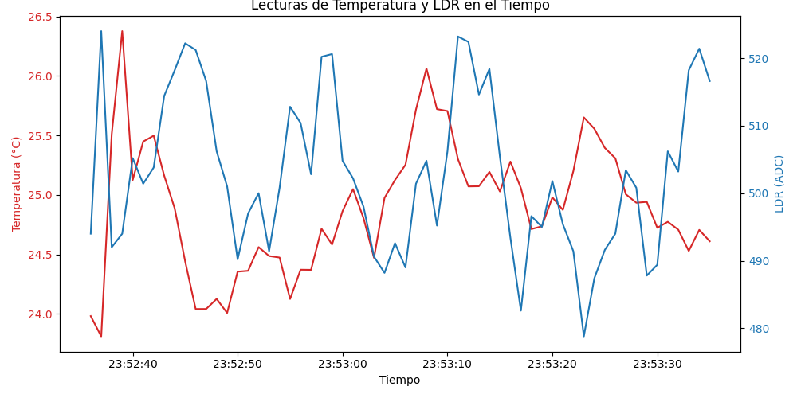

# Proyecto: Registro de Sensores en Wokwi (Adquisición de Datos)

Este repositorio contiene un sistema de adquisición de datos desarrollado en Python para capturar lecturas de **Temperatura** y **LDR** (intensidad de luz) desde un simulador Wokwi o hardware físico vía Serial. El proyecto aplica estructuras de datos fundamentales y técnicas de procesamiento de señales en un contexto de ingeniería electrónica.

##  Características
* **Adquisición en tiempo real:** Captura de datos durante 60 segundos con timestamps ISO 8601.
* **Procesamiento de Señal (Mejora A):** Implementación de un filtro de **Media Móvil** para reducir el ruido de las lecturas analógicas.
* **Almacenamiento Seguro:** Generación de archivos CSV de forma atómica para evitar corrupción de datos.
* **Visualización:** Generación automática de gráficas comparativas con doble eje (Temperatura y LDR).
* **Automatización:** Configuración de GitHub Actions para validación de sintaxis en Python.

##  Resultados de la Adquisición

A continuación se muestra la gráfica generada tras la última ejecución del sistema. En ella se observa el comportamiento de los sensores y la suavidad de las señales gracias al filtrado implementado:



##  Estructura del Repositorio
* `src/`: Contiene el código fuente principal (`run_acquisition.py`).
* `results/`: Carpeta con los datos capturados (`raw_readings.csv`), metadatos y gráficas.
* `docs/`: Documentación técnica y notas del código (`NOTES.md`).
* `presentation/`: Créditos y registro de contribuciones.
* `ANALYSIS.md`: Comparativa técnica sobre la mejora de filtrado implementada.
* `CHANGELOG.md`: Historial de versiones y cambios significativos.

##  Instalación y Uso

1. **Clonar el repositorio:**
   ```bash
   git clone [https://github.com/TheYqhir/F04.git](https://github.com/TheYqhir/F04.git)
   cd F04
